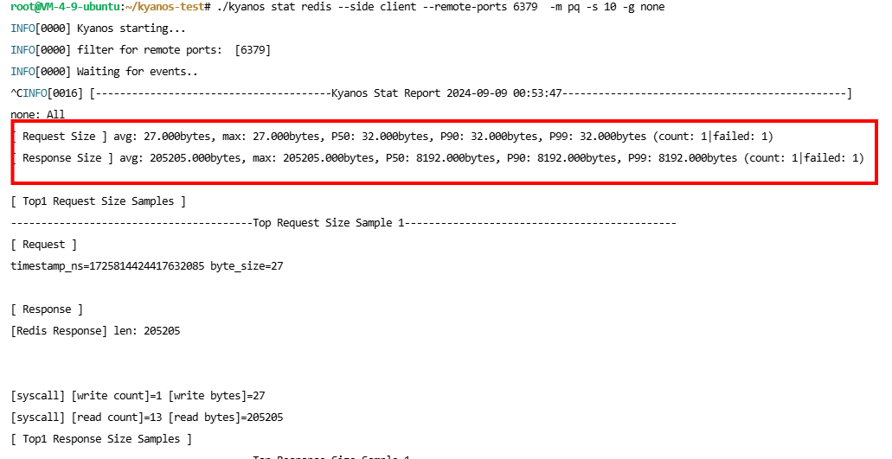

# kyanos


[简体中文](./README_CN.md) | English 

  [](#) [](#) [](#-license)

⭐ Think Kyanos is cool? Give it a star!

[](https://x.com/intent/tweet?text=Check%20out%20this%20project%20on%20GitHub:%20https://github.com/hengyoush/kyanos%20%23OpenIDConnect%20%23Security%20%23Authentication)
[](https://www.facebook.com/sharer/sharer.php?u=https://github.com/hengyoush/kyanos)
[](https://www.linkedin.com/sharing/share-offsite/?url=https://github.com/hengyoush/kyanos)
[](https://www.reddit.com/submit?title=Check%20out%20this%20project%20on%20GitHub:%20https://github.com/hengyoush/kyanos)
[](https://t.me/share/url?url=https://github.com/hengyoush/kyanos&text=Check%20out%20this%20project%20on%20GitHub)

## Table of Contents
- [Motivation](#-motivation)
- [What is kyanos](#-what-is-kyanos)
- [Requirements](#-requirements)
- [How to get kyanos](#-how-to-get-kyanos)
- [Usage](#-usage)
- [Feedback and Contributions](#-feedback-and-contributions)
- [Contacts](#%EF%B8%8F-contacts)

## 🚀 Motivation

>  Have you ever faced this situation:  
You're responsible for a service, and one day, an angry client storms over 😡, asking why your API is timing out?  
You panic 😩 but try to remain calm as you check the monitoring, only to find that your service's API response time is normal.   
Just as you're about to fire back, you suddenly remember that your company's monitoring only tracks the server-side application response time, but not the delays caused by the kernel or network! Now, neither of you can convince the other 👿, and what follows is a long blame game, ultimately with no resolution.

> On the flip side, when your request to a downstream API times out but their monitoring shows no issues, the blame game starts again—except this time, you're on the other side...

🤓👍However, with Kyanos, a single command allows you to retrieve the slowest HTTP requests on this machine:


If you need to print the request and response body, you can do it like this:


## 🎓 What is kyanos

Kyanos was created specifically for rapid network troubleshooting. It is a **developer-focused** network issue analysis tool with the following features💪：  
- 😏 Simple and user-friendly: Unlike other network analysis tools, it focuses on the request-response perspective rather than individual packets. There's no need to manually figure out which captured packets are requests and which are responses—`kyanos` automatically matches them for you.
- 🏎 Highly flexible: `kyanos` is based on each request-response pair, tracking the time taken and the packet size for each interaction. It can also aggregate data to higher levels as needed, making it extremely flexible to use. With just one command, you can easily do things like: find the top 5 slowest `HTTP` request-response pairs and print the corresponding request and response bodies!
- 🔎 Deep kernel-level data collection, no more blind spots: `kyanos` is built on `eBPF` technology, enabling it to capture detailed timings for each request-response packet within the kernel's protocol stack. The most useful timing data, such as 1. the time it takes for requests/responses to reach the network card and 2. the time spent reading data from the socket buffer, are all automatically collected by `kyanos`.
- ⚙ Excellent compatibility: `kyanos` supports kernels as early as version 3.10.

## ❗ Requirements

Kyanos currently supports kernel versions 3.10 and 4.14 or above (with plans to support versions between 4.7 and 4.14 in the future).  
> You can check your kernel version using `uname -r`.

At the moment, running Kyanos inside a container requires privileged mode.

## 🎯 How to get kyanos 
To fetch the latest Kyanos executable file, you can use the following script:
```bash
wget -O kyanos.zip https://github.com/hengyoush/kyanos/releases/download/v1.3.0/kyanos.zip
unzip kyanos.zip
chmod a+x kyanos

sudo kyanos
```

## 📝 Usage

Kyanos currently has two main features:

1. **watch**: Used to monitor each request-response pair, including: request and response bodies, timing information (such as total time, network time, and time spent reading from the socket buffer), and request and response sizes.
2. **stat**: Unlike `watch`, which is more granular, `stat` allows for custom aggregation conditions to observe higher-level information, such as: timing details for a connection (including average time, P99 line, etc.), request sizes, and more.

### 🔍 Watch

Usage：

```bash
./kyanos watch --help
It is possible to filter network requests based on specific protocol and print the request/response data to the console.

Usage:
  kyanos watch [http|redis|mysql] [filter] [flags]
  kyanos watch [command]

Available Commands:
  http        watch HTTP message
  mysql       watch MYSQL message
  redis       watch Redis message

Flags:
  -l, --list            --list # list all support protocols
      --latency float   --latency 100 # millseconds
      --req-size int    --req-size 1024 # bytes
      --resp-size int   --resp-size 1024 # bytes
      --side string     --side client|all|server (default "all")
  -h, --help            help for watch

Global Flags:
  -d, --debug                  print more logs helpful to debug
      --ifname string          --ifname eth0 (default "eth0")
      --local-ports strings    specify local ports to trace, default trace all
  -p, --pid int                specify pid to trace, default trace all process
      --remote-ips strings     specify remote ips to trace, default trace all
      --remote-ports strings   specify remote ports to trace, default trace all
  -v, --verbose                print verbose message
```

As a fundamental capability, Kyanos supports traffic capture for multiple protocols (currently supporting HTTP, Redis, MySQL). It also supports filtering based on response size, response time, application layer protocols, and specific conditions related to those protocols (such as HTTP path, method, etc.).

Supports the following general (protocol-independent) filtering conditions:

| Filter Condition         | Command Line Flag | Example                                                                                     |
|--------------------------|-------------------|---------------------------------------------------------------------------------------------|
| Request-Response Latency | `--latency`       | `--latency 100`  Only observe request-response pairs with latency exceeding 100ms.          |
| Request Size in Bytes    | `--req-size`      | `--req-size 1024`  Only observe request-response pairs with request size exceeding 1024 bytes. |
| Response Size in Bytes   | `--resp-size`     | `--resp-size 1024`  Only observe request-response pairs with response size exceeding 1024 bytes. |
| Local Port of Connection | `--local-ports`   | `--local-ports 6379,16379`  Only observe request-response pairs on connections with local ports 6379 and 16379. |
| Remote Port of Connection| `--remote-ports`  | `--remote-ports 6379,16379`  Only observe request-response pairs on connections with remote ports 6379 and 16379. |
| Remote IP of Connection  | `--remote-ips`    | `--remote-ips 10.0.4.5,10.0.4.2`  Only observe request-response pairs on connections with remote IPs 10.0.4.5 and 10.0.4.2. |
| Process PID              | `--pid`           | `--pid 12345`  Only observe request-response pairs related to local process 12345.            |

Supports the following protocols and their respective filtering conditions:

#### HTTP

| Filter Condition | Command Line Flag | Example                                                        |
|------------------|-------------------|----------------------------------------------------------------|
| Request Path     | `--path`          | `--path /foo/bar`  Only observe requests with the path `/foo/bar`. |
| Request Host     | `--host`          | `--host www.baidu.com`  Only observe requests with the host `www.baidu.com`. |
| Request Method   | `--method`        | `--method GET`  Only observe requests with the method `GET`.        |

#### Redis

| Filter Condition | Command Line Flag | Example                                                     |
|------------------|-------------------|-------------------------------------------------------------|
| Request Command  | `--command`       | `--command GET,SET`  Only observe requests with commands `GET` and `SET`. |
| Request Key      | `--keys`          | `--keys foo,bar`  Only observe requests with keys `foo` and `bar`. |
| Request Key Prefix | `--key-prefix` | `--key-prefix foo:bar`  Only observe requests with key prefix `foo:bar`. |

MYSQL

> MySQL protocol capture is supported, but filtering based on conditions is still in progress...


### 📈 Stat  

These features only provide a granular analysis perspective. `Stat` offers more flexible and high-dimensional analysis capabilities. It can do things such as:

- Output the top 10 HTTP connections with the longest network latency every 5 seconds: `./kyanos stat http --side client -i 5 -m n -l 10 -g conn`  
  
  
- Output the top 10 HTTP request-response pairs with the largest response sizes every 5 seconds: `./kyanos stat http --side client -i 5 -m p -s 10 -g none`  
  
  
- Output the 10 slowest Redis requests to the cluster: `./kyanos stat redis --side client --remote-ports 6379 -m t -s 10 -g none --full-body`  
  

Here's a detailed explanation of how to use the commands.
```bash
./kyanos stat --help
Analysis connections statistics

Usage:
  kyanos stat [-m pqtsn] [-s 10] [-g conn|remote-ip|remote-port|local-port|protocol|none] [flags]
  kyanos stat [command]

Available Commands:
  http        watch HTTP message
  mysql       watch MYSQL message
  redis       watch Redis message

Flags:
  -m, --metrics string    -m pqtsn (default "t")
  -s, --sample int        -s 10
  -l, --limit int         -l 20 (default 10)
  -i, --interval int      -i 5
  -g, --group-by string   -g remote-ip (default "remote-ip")
      --latency float     --latency 100 # millseconds
      --req-size int      --req-size 1024 # bytes
      --resp-size int     --resp-size 1024 # bytes
      --side string       --side client|all|server (default "all")
      --sort string       --sort avg|max|p50|p90|p99 (default "avg")
      --full-body         --full-body 
  -h, --help              help for stat

Global Flags:
  -d, --debug                  print more logs helpful to debug
      --ifname string          --ifname eth0 (default "eth0")
      --local-ports strings    specify local ports to trace, default trace all
  -p, --pid int                specify pid to trace, default trace all process
      --remote-ips strings     specify remote ips to trace, default trace all
      --remote-ports strings   specify remote ports to trace, default trace all
  -v, --verbose                print verbose message
```
### Observation Metrics (`-m`)

The `stat` command can observe 5 different metrics, as follows:

| Metric               | Flag |
|----------------------|------|
| Total Time           | `t`  |
| Response Size        | `p`  |
| Request Size         | `q`  |
| Network Latency      | `n`  |
| Time from Socket Buffer | `s`  |

You can freely combine these metrics. For example, `-m pq` will observe both request and response sizes:


### Aggregation Dimensions (`-g`)

The `-g` option specifies how request-response data should be categorized and aggregated. For example, if you want to analyze the quality of service provided by different remote services, you can use `-g remote-ip` to aggregate statistics by remote IP addresses. This will allow you to see the latency for different remote IPs and easily identify which remote service may be causing issues.

Currently, there are 5 aggregation dimensions, all of which are protocol-independent (protocol-specific dimensions, such as HTTP path aggregation, will be supported in the future).

| Aggregation Dimension | Value       |
|-----------------------|-------------|
| Finest granularity, aggregates to individual connections | `conn`      |
| Remote IP             | `remote-ip` |
| Remote Port           | `remote-port` |
| Local Port            | `local-port` |
| Connection Protocol   | `protocol`  |
| Coarsest granularity, aggregates all request-response pairs | `none`      |

### Output Samples

When you identify connections with very high latency, it can be very helpful to see the request-response pairs with the highest latency on those connections. Kyanos provides the `--sample` (`-s`) parameter to specify the number of samples to include for each aggregation dimension.

The `full-body` option allows you to specify whether to print the full request and response bodies or just the summary information. By default, only summary information is printed.


## 🤝 Feedback and Contributions
> [!IMPORTANT]
> If you encounter any issues or bugs while using the tool, please feel free to ask questions in the issue tracker.

## 🗨️ Contacts
For more detailed inquiries, you can use the following contact methods:
- **My Email:** [hengyoush1@163.com](mailto:hengyoush1@163.com)
- **My Blog:** [http://blog.deadlock.cloud](http://blog.deadlock.cloud/)

[Back to top](#top)
